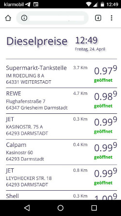

# Fuelprice-Monitor

Small HTML5 App to display actual fuelprices from stations in the physical environment. Supports the geolocation of user's device. Fetches the free price database "Tankerkönig" https://creativecommons.tankerkoenig.de/

* HTML5
* jQuery
* handlebars.js

Fuel prices powered by <a href="http://www.tankerkoenig.de" target="_blank">http://www.tankerkoenig.de</a> 
Die Daten stehen unter der Creative-Commons-Lizenz “CC BY 4.0”
